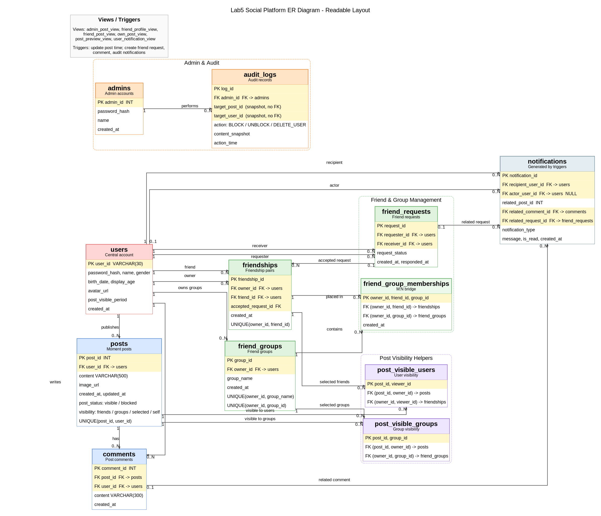

# 实验五 数据库应用开发大作业报告

**题目：** 简易朋友圈系统  
**姓名：** 沈天裕  
**学号：** 24300720084  
**小组分工：** 个人独立完成系统设计、数据库建模、后端接口、前端展示、命令行交互与测试数据初始化。

## 1. 系统总体设计

本系统基于 Python 与 MySQL 实现一个简易朋友圈平台，功能参考微信朋友圈，但做了适合数据库课程作业的简化。系统分为普通用户端和管理员端：普通用户可以注册、登录、修改资料、搜索和管理好友、发表和评论朋友圈、查看通知；管理员可以登录、修改资料、审核朋友圈以及注销用户。

项目采用“前端页面 + Python 后端 + MySQL 数据库”的结构：

```text
frontend.html / cli_app.py
        ↓
app.py：接口处理、事务管理、错误处理
        ↓
MySQL：表、外键、约束、视图、触发器
```

其中 `frontend.html` 提供网页交互界面，`cli_app.py` 提供命令行菜单版交互，二者都复用 `app.py` 中的数据库操作逻辑。数据库结构、完整性约束、视图和触发器集中写在 `schema.sql` 中，初始化测试数据写在 `init_data.sql` 中。

## 2. ER 图

系统 ER 图如下：



主要实体包括普通用户、管理员、好友申请、好友关系、好友分组、朋友圈、评论、通知和审核日志。好友关系采用“双向好友两条记录”的方式保存；朋友圈可见范围支持全部好友、指定分组、指定好友和仅自己可见。

## 3. 表结构与完整性约束

系统共设计 12 张主要表：

| 表名 | 作用 |
| --- | --- |
| `users` | 普通用户账号、密码、昵称、性别、生日、展示年龄、头像、朋友圈可见时长 |
| `admins` | 管理员账号、密码、姓名 |
| `friend_groups` | 用户自定义好友分组 |
| `friend_requests` | 好友申请及处理状态 |
| `friendships` | 双向好友关系 |
| `friend_group_memberships` | 好友与分组的多对多关系 |
| `posts` | 朋友圈内容、图片、状态、可见范围、更新时间 |
| `post_visible_groups` | 指定分组可见的朋友圈权限 |
| `post_visible_users` | 指定好友可见的朋友圈权限 |
| `comments` | 朋友圈评论 |
| `notifications` | 好友申请、评论、审核等通知 |
| `audit_logs` | 管理员审核和注销操作日志 |

完整性约束主要包括：

1. **主键约束：** 每张表都有主键，例如 `users.user_id`、`posts.post_id`、`comments.comment_id`。
2. **外键约束：** 评论依赖朋友圈和用户，朋友圈依赖用户，好友关系依赖用户，通知依赖接收方用户等。
3. **级联删除：** 删除用户时，其朋友圈、评论、好友关系、通知等相关信息会自动删除；删除朋友圈时，相关评论自动删除。
4. **唯一性约束：** 用户账号不可重复；同一个用户的好友分组名不可重复；双向好友表中同一方向的好友关系不可重复。
5. **检查约束：** 限制用户 ID 格式、展示年龄范围、朋友圈字数和评论字数。例如朋友圈内容限制为 1 到 500 字。

示例约束如下：

```sql
CONSTRAINT chk_posts_content
CHECK (CHAR_LENGTH(content) > 0 AND CHAR_LENGTH(content) <= 500);

CONSTRAINT fk_comments_post
FOREIGN KEY (post_id) REFERENCES posts(post_id)
ON DELETE CASCADE
ON UPDATE CASCADE;
```

## 4. 视图设计

为了简化查询逻辑并体现隐私控制，系统设计了 6 个视图：

| 视图名 | 作用 |
| --- | --- |
| `admin_post_view` | 管理员审核朋友圈，只展示朋友圈信息和 `user_id`，不展示生日等个人基本信息 |
| `friend_profile_view` | 用户查看好友资料，只展示昵称、性别、展示年龄、头像和分组 |
| `friend_post_view` | 用户查看好友朋友圈，自动判断好友关系、可见范围和可见时长 |
| `own_post_view` | 用户查看自己的朋友圈，包括仅自己可见和被管理员屏蔽的朋友圈 |
| `post_preview_view` | 加好友前预览最近三个月、全部好友可见且未屏蔽的朋友圈 |
| `user_notification_view` | 用户查看通知列表，合并通知、申请状态和发起人昵称 |

其中最关键的是 `friend_post_view`，它把“是否是好友”“作者设置的可见时长”“朋友圈可见范围”组合在一起判断。这样前端和后端不用重复写复杂判断，只需要查询视图即可。

管理员端使用 `admin_post_view`，满足“管理员不可浏览用户个人基本信息，但可以浏览所有朋友圈并审核”的要求。

## 5. 事务管理与触发器

### 5.1 事务管理

系统在 `app.py` 中封装了事务函数：

```python
def execute_transaction(statements):
    sql = "START TRANSACTION;\n" + ";\n".join(statements) + ";\nCOMMIT;"
    execute(sql)
```

以下操作使用事务保证一致性：

1. **发表朋友圈：** 插入朋友圈后，同时插入指定分组或指定好友的可见权限。
2. **接受好友申请：** 更新申请状态，并插入双方好友关系。
3. **删除好友：** 同时删除双方方向的好友关系。
4. **管理员审核朋友圈：** 更新朋友圈状态，并写入审核日志。
5. **管理员注销用户：** 写入审核日志，并删除用户及相关信息。

例如接受好友申请时，必须同时完成“申请状态变为 accepted”和“双方成为好友”。如果其中一步失败，整个事务失败，避免出现状态不一致。

### 5.2 触发器

系统设计了 5 个触发器：

| 触发器 | 触发时机 | 作用 |
| --- | --- | --- |
| `trg_posts_before_update` | 更新朋友圈前 | 自动更新 `updated_at` |
| `trg_friend_requests_after_insert` | 插入好友申请后 | 通知接收方处理申请 |
| `trg_friend_requests_after_update` | 接受或拒绝好友申请后 | 通知申请发起方结果 |
| `trg_comments_after_insert` | 插入评论后 | 通知朋友圈作者和可见范围内相关用户 |
| `trg_audit_logs_after_insert` | 写入审核日志后 | 通知用户朋友圈被屏蔽或恢复 |

例如好友申请被处理后，触发器会自动生成通知：

```sql
CREATE TRIGGER trg_friend_requests_after_update
AFTER UPDATE ON friend_requests
FOR EACH ROW
BEGIN
    IF OLD.request_status = 'pending'
       AND NEW.request_status IN ('accepted', 'rejected') THEN
        INSERT INTO notifications (...)
        VALUES (...);
    END IF;
END;
```

触发器的设计让系统的自动行为保存在数据库层，即使将来改成交互方式或直接执行 SQL，也能保持一致。

## 6. 功能实现与错误处理

后端主要逻辑集中在 `app.py` 中，每个功能对应一个函数。例如：

- `register_user()`：用户注册
- `login_user()`：用户登录
- `send_friend_request()`：发送好友申请
- `respond_friend_request()`：接受或拒绝申请
- `create_post()`：发表朋友圈
- `add_comment()`：发表评论
- `admin_set_post_status()`：管理员审核朋友圈
- `admin_delete_user()`：管理员注销用户

错误处理主要通过 `require_exists()`、`require_not_exists()` 和 `ValueError` 实现。例如，用户添加不存在的人、重复发送待处理好友申请、删除不存在的朋友圈等都会返回明确错误信息。前端收到错误后会在页面提示，命令行版则打印错误原因。

示例：

```python
require_exists(
    f"SELECT 1 FROM users WHERE user_id = {sql_literal(receiver_id)} LIMIT 1",
    "申请对象不存在",
)
```

系统提供两种交互方式：

1. **网页前端：** 登录/注册后进入普通用户端或管理员端，适合验收演示。
2. **命令行菜单：** `cli_app.py` 提供最小菜单交互，便于讲解后端逻辑。

## 7. 初始化数据与运行方式

初始化数据库：

```bash
mysql --login-path=lab5root < schema.sql
mysql --login-path=lab5root < init_data.sql
```

启动网页端：

```bash
python3 app.py
```

浏览器打开：

```text
http://127.0.0.1:8005
```

启动命令行版：

```bash
python3 cli_app.py
```

默认测试账号：

```text
普通用户：Alice093427 / 123456
管理员：9001 / admin123
```

初始化数据中包含多名普通用户、一名管理员、好友关系、好友分组、朋友圈、评论、通知和审核日志，便于验收时直接演示。

## 8. 总结

本系统完成了实验要求中的用户注册登录、个人资料修改、好友搜索添加删除、好友分组、朋友圈发表修改删除、评论、通知、管理员审核和用户注销等功能。数据库层面设计了完整的表结构、主外键约束、检查约束、视图、事务和触发器。系统既能通过网页端进行直观展示，也能通过命令行版说明每个功能对应的数据库操作逻辑。
